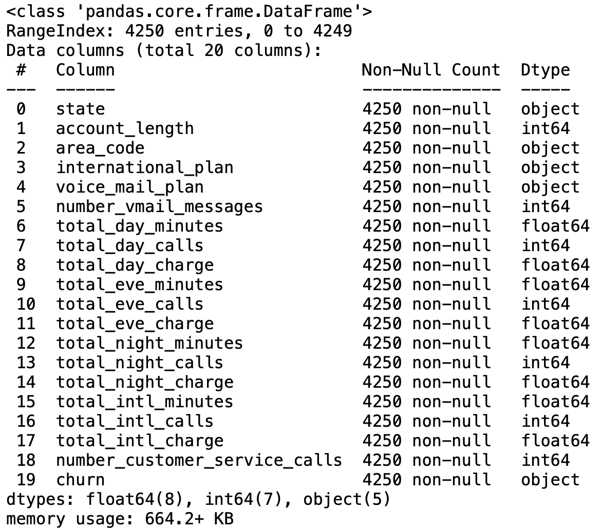

# Telco Churn Prediction

This project is about predicting whether a customer will change telecommunications provider, something known as "churning".

### File descriptions

<ul>
  <li> train.csv - the training set - Contains 4250 lines with 20 columns. 3652 samples (85.93%) belong to class churn=no and 598 samples (14.07%) belong to class churn=yes </li>
  <li>test.csv - the test set - Contains 750 lines with 20 columns: the index of each sample and the 19 features (missing the target variable "churn"). </li>
</ul>

### Data fields

| Field  | Understanding |
| ------------- | ------------- |
| state  | string. 2-letter code of the US state of customer residence  |
| account_length  | numerical. Number of months the customer has been with the current telco provider  |
| area_code | string="area_code_AAA" where AAA = 3 digit area code.  |
| international_plan  | (yes/no). The customer has international plan.  |
| voice_mail_plan  | (yes/no). The customer has voice mail plan.  |
| number_vmail_messages  | numerical. Number of voice-mail messages.  |
| total_day_minutes  | numerical. Total minutes of day calls.  |
| total_day_calls  | numerical. Total number of day calls.  |
| total_day_charge  | numerical. Total charge of day calls.  |
| total_eve_minutes  | numerical. Total minutes of evening calls.  |
| total_eve_calls  | numerical. Total number of evening calls. |
| total_eve_charge  | numerical. Total charge of evening calls.  |
| total_night_minutes  | numerical. Total minutes of night calls.  |
| total_night_calls  | numerical. Total number of night calls.  |
| total_night_charge  | numerical. Total charge of night calls.  |
| total_intl_minutes  | numerical. Total minutes of international calls.  |
| total_intl_calls  | numerical. Total number of international calls.  |
| total_intl_charge  | numerical. Total charge of international calls  |
| number_customer_service_calls  | numerical. Number of calls to customer service  |
| churn  | Customer churn - target variable. |

### Project Flow

<ol>
 <li>Importing and investigating the data.</li>
 <li>Data Pre-processing</li>
 <li>Train-Test Split</li>
 <li>Random Forest Model</li>
 <li>Logistic Regression Model</li>
 <li>K-Nearest Neighbors Model.</li>
 <li>Model Comparison.</li>
 <li>Results</li>
</ol>

### 1. Importing and investigating the data.

After importing both the training and testing data, we check information about the train set by calling the .info() method:

