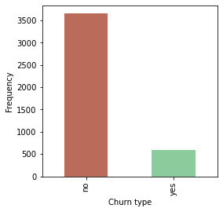
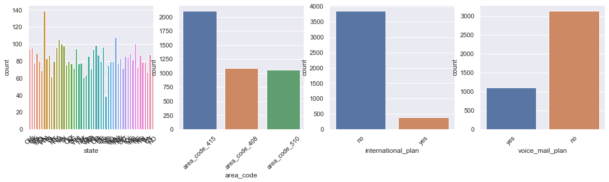
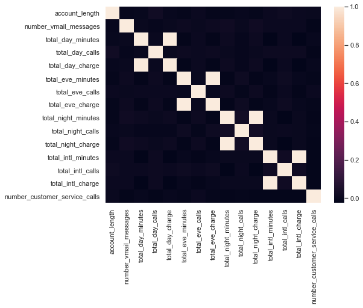

# Telco Churn Prediction

This project is about predicting whether a customer will change telecommunications provider, something known as "churning".

This project is about predicting whether a customer will change telecommunications provider, something known as “churning”.
Customer churn is the percentage of customers that stopped using your company’s product or service during a certain time frame.

### Why Is Customer Churn Rate Important?

To learn why this is the case, we need to understand that it costs more to acquire new customers than it does to retain existing customers.
CAC is defined as the net cost of sales and marketing required to aquire a new customer. Regardless of the efforts a company puts in terms of effectiveness of it’s marketing campaign or providing more and more services to it’s customers at a cheap cost, there would be some customers who would inevitably tend to churn out of their system. There can be several reasons for this, like, a customer may tend to sway towards a competitor offering similar services at a lower cost or they may be providing tailor-made plans to customer which would be better suited to their needs.

For acquiring every new customer, the cost associated with this (CAC) tends to be far more than that associated with keeping a customer into the system of a company. Moreover, by keeping overall customer management costs low, a company can focus it’s time and effort into improving the features of their product and the quality of their services, which will ultimately improve the health of the company financially.

### File descriptions

<ul>
  <li> train.csv - the training set - Contains 4250 lines with 20 columns. 3652 samples (85.93%) belong to class churn=no and 598 samples (14.07%) belong to class churn=yes </li>
  <li>test.csv - the test set - Contains 750 lines with 20 columns: the index of each sample and the 19 features (missing the target variable "churn"). </li>
</ul>

### Data fields

| Field  | Understanding |
| ------------- | ------------- |
| state  | string. 2-letter code of the US state of customer residence  |
| account_length  | numerical. Number of months the customer has been with the current telco provider  |
| area_code | string="area_code_AAA" where AAA = 3 digit area code.  |
| international_plan  | (yes/no). The customer has international plan.  |
| voice_mail_plan  | (yes/no). The customer has voice mail plan.  |
| number_vmail_messages  | numerical. Number of voice-mail messages.  |
| total_day_minutes  | numerical. Total minutes of day calls.  |
| total_day_calls  | numerical. Total number of day calls.  |
| total_day_charge  | numerical. Total charge of day calls.  |
| total_eve_minutes  | numerical. Total minutes of evening calls.  |
| total_eve_calls  | numerical. Total number of evening calls. |
| total_eve_charge  | numerical. Total charge of evening calls.  |
| total_night_minutes  | numerical. Total minutes of night calls.  |
| total_night_calls  | numerical. Total number of night calls.  |
| total_night_charge  | numerical. Total charge of night calls.  |
| total_intl_minutes  | numerical. Total minutes of international calls.  |
| total_intl_calls  | numerical. Total number of international calls.  |
| total_intl_charge  | numerical. Total charge of international calls  |
| number_customer_service_calls  | numerical. Number of calls to customer service  |
| churn  | Customer churn - target variable. |

### Project Flow

<ol>
 <li>Importing and investigating the data</li>
 <li>Data Pre-processing</li>
 <li>Train-Test Split</li>
 <li>Random Forest Model</li>
 <li>Logistic Regression Model</li>
 <li>K-Nearest Neighbors Model</li>
 <li>Model Comparison</li>
 <li>Results</li>
</ol>

### 1. Importing and investigating the data

After importing both the training and testing data, we check information about the train set by calling the .info() method:

As we can see, the data does not contain any null values. There are two types of numerical data in the dataframe - int64 and float64. The categorical data is mentioned against object datatype.

### 2. Data Pre-processing

Checking the distribution of the target variable first:

Almost ~86% cases belong to churn=0 case while ~14% cases belong to churn=1 case.

* Categorical columns:

Used select_dtypes method to take up columns with datatype = object.

['state', 'area_code', 'international_plan', 'voice_mail_plan']

EDA on categorical variables
Countplots were built using seaborn’s countplot method to understand distribution of categorical variables.

Preprocessing on categorical columns -> One Hot Encoding

* Numerical columns:

Used select_dtypes method to take up columns with datatype = int64|float64.

['account_length', 'number_vmail_messages', 'total_day_minutes',
       'total_day_calls', 'total_day_charge', 'total_eve_minutes',
       'total_eve_calls', 'total_eve_charge', 'total_night_minutes',
       'total_night_calls', 'total_night_charge', 'total_intl_minutes',
       'total_intl_calls', 'total_intl_charge',
       'number_customer_service_calls']

       
EDA on numerical columns
This is a correlation matrix plot to understand distribution of correlation between the numerical variables. As we can see from the plot, most of the variables are not too much related with each other, except for the varaibles that account for total minutes of day, evening, night and international calls with their charges, something which is to be expected of the nature of data we are dealing with.

Preprocessing on numerical columns -> Standard Scaling   

A Pipeline method was created to facilitate data preprocessing. Target column 'churn' was label-encoded.

### 3. Train-Test Split

Data was split into training and testing sets using sklearn.model_selection library. 
Train_size = 66.67%
Test_size  = 33.33%

### 4. Random Forest Model

Random forest is ensemble machine learning algorithm which builds a combination of several decision trees. The decision trees themselves are weak learners but when they are ensembled by the random forest algorithm, the predictive power of the algorithm is increased significantly and the model also generalizes better on unseen data. The trees are built by taking samples of data, with replacement from the original data. Each tree is grown to it’s maximum depth level and there is no pruning in the trees.

### Advantages of Random Forest Model:
<ul>
<li>It has a very high accuracy generally compared to the conventional machine learning algorithms.</li>
<li>It does not overfit on training data.</li>
<li>It can be run on large datasets and is also able to handle thousands of input variables without needing explicit variable selection methods.</li>
<li>It is can solve both regression and classification problems.</li>
<li>It can be used to select important features which play a major role in determining the target variable by use of the feature importance plot.</li>
<li>It can handle missing data by estimation of the missing values and the algorithm performs robustly even when a large proportion of data points are missing.</li>
<li>It performs well in case of unbalanced class prediction problem.</li>
</ul>

### Disadvantages are as follows:
<ul>
<li>The Random Forest model is difficult to interpret.</li>
<li>For large datasets with too many features, the random forest model consumes a lot of memory.</li>
<li>The algorithm produces wild predictions for test observations never seen before by the training data. For example, for a training data containing two variables x and y with the range of x variable from 50 to 80: If the test data has x = 150, the algorithm would give an unreliable prediction.</li>
<li>It takes tong time to run as it build a large number of trees.</li>
</ul>

Accuracy of the model: 93.0%

Confusion matrix:
|  | 0 (Predicted) | 1 (Predicted) |
| ------------- | ------------- | ------------- |
| 0 (Actual) | 1191 | 0 |
| 1 (Actual) | 93 | 119 |

### Feature Importance

There are two types of feature importances that can be calculated in case of random forest model. Impurity based feature importance and permutation based feature importance.

As we have one hot encoded the categorical columns, we have increased the number of features in our data from 19 to 79, and this will give a distorted understanding of feature importances of the variables.

Furthermore, impurity-based importances are computed on training set statistics and therefore do not reflect the ability of feature to be useful to make predictions that generalize to the test set.

Hence, we will use permutation_importance method.

The permutation_importance method will be permuting categorical columns before they get one-hot encoded.

### 5. Logistic Regression Model

Logistic regression is a classification algorithm which belongs to the family of generalized linear models. It is a used when the response variable is binary (1 or 0). The model returns the probability of occurrence of the target variable which is converted to 0 or 1 prediction using a particular threshold.
The model basically applies sigmoid function to the output of a linear regression model.

### Advantages of Logistic Regression Model:
<ul>
<li>Logistic Regression is one of the simplest and easy to interpret machine learning algorithms.</li>
<li>It does not require very high computational power or memory.</li>
<li>It is less prone to over-fitting in a low dimensional dataset having a sufficient number of training examples.</li>
<li>It makes no assumptions about the distribution of the classes in the data.</li>
<li>The predicted parameters (trained weights) give inference about the importance of each feature. The direction of association i.e. positive or negative is also given. his can be used to understand the relationship between various features.</li>
<li>This algorithm can easily be extended to multi-class classification using a SoftMax function, which is known as Multinomial Logistic Regression.</li>
<ul>
  
### Disadvantages are as follows:
<ul>
<li>Logistic Regression requires that the independent variable should be linearly related to the log odds (log(p/(1-p)).</li>
<li>The algorithm is only able to build linear decision boundaries to separate data of different classes. This means that problems involving formation of non-linear boundaries cannot be solved by this algorithm.</li>
<li>Adding too many features to the model which may suffer from multicollinearity can degrade the predictive power of the model.</li>
<li>More powerful algorithms like Neural Networks, SVM, Random Forest can easily outperform this algorithm.</li>
<li>The algorithm is sensitive to outliers and as such when the data values deviate from expected ranges, this can lead to erratic classification of the data point which may affect the overall accuracy and interpretability of the model as it would also affect the Sensitivity and Specificity of the results of the algorithm.</li>
</ul>

Accuracy of the model: 86.0%

Confusion matrix:
|  | 0 (Predicted) | 1 (Predicted) |
| ------------- | ------------- | ------------- |
| 0 (Actual) | 1167 | 24 |
| 1 (Actual) | 166 | 46 |

### 6. K-Nearest Neighbors Model

KNN is a simple and easy to interpret supervised machine learning algorithm that can be used to solve both classification and regression problems. The algorithm works by trying to determine the class of a data point by looking at the class of it’s K nearest neighbors. It assumes that data points which are close to each other belong to the same class and uses a distance metric like Euclidean distance or other metric to find the distance between data points. KNN is a non-linear classifier, so it will work with data that cannot be simply classified with the help of linear classifiers.

However, it does not perform well if the dataset is too large or has too many features. The model also requires feature scaling as features of different scales can give a distorted picture of distance between data points. It is also sensitive to missing data and presence of outliers.

Accuracy of the model: 88.0%

Confusion matrix:
|  | 0 (Predicted) | 1 (Predicted) |
| ------------- | ------------- | ------------- |
| 0 (Actual) | 1181 | 10 |
| 1 (Actual) | 163 | 49 |

### 7. Model Comparison

Table with accuracy in percentage of all the models: 

### 8. Results

Graphical comparison: 

As we can see, Random Forest model performed the best out of all the models used here.

## Other Key Indicators to look out for

1. Pricing points of competitors and their subscription models
How the competitors have designed their subscription model ? What are the time spans for which they offer their services? How are these models priced?

2. Customer behaviour pattern
How likely are the customers to exit the system based on the frequency of usage of services of the company by customers? How does their behaviour change if the company tweaks their price point or the model of subscription/quality of it’s services? How do they react if the company provides additional servies like Amazon Prime Video or Netflix subscription along with it’s package?

3. Competitor reaction
How did the competition react to changes made by the company or by a change in market conditions? Did they offer discounts on thier services or include more services into their product line by incorporating newer technologies or partnering with other firms to get more product support?

## Ways to Reduce Customer Churn

1. Focussing attention towards your better customers
Instead of spending huge amount of resources to try to incentivize the customers who are likely to churn based on customer behaviour analysis, it is better for the company to spend those resources on it’s existing customers. This will not only ensure customer loyalty but will also create meaningful long term relationship with those customers.

2. Analyzing customer churn pattern
Analyzing the churn pattern of customers is the key method by which it can understand which customers are about to leave and which features of a company’s product are most important to the customers. It may be possible that customers prefer all: low, medium and high valued products or subscriptions that would be suitable to them according to their needs or they may also prefer only low valued products. Changing churn behaviour of customers when pricing or features of products are changed along with time is also an essential analysis that must be done by the company.

3. Developing a grievance redressal system
While using a company’s products, it is very likely that they will have some issues with them at some point of time. Therefore, it is extremely essential that a company install a feedback system and also create a system of fast and reliable customer service. These things add up a lot to increase the overall customer experience over long durations of time.

4. Creating a new subscription model and improving renewal system
While a company may have designed their products and subscription models to tend to the need of it’s customers, it may be better off it can provide more tailor made packages and features to it’s customers. This will ensure that they get to pay only for the services that they actually need and do not end up paying extravagantly for services they have no use for.
The company should also focus on improving it’s renewal model by providing flexibility to it’s customers for auto-renewal or change of subscription plan during run-period of subscription of an already subscribed plan.
